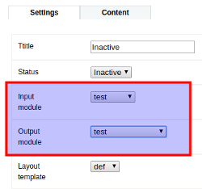

    
<h1>Dzhim CMS</h1>

    

    
A very basic <strong>C</strong>ontent <strong>M</strong>anagement <strong>S</strong>ystem written in PHP.

## Basic features

### Page tree management

* Create, edit, delete, sort, hide pages and sub-pages.
* Set a default page or a default language - Do You want 'Products' to be the landing page or maybe want to change the site's main language?
Easy! Just check 'Default page/language' in settings.

* [How to create a page or a sub-page?](docs/How-to/Manage-pages/README.md)
* [How to change page sequence?](docs/How-to/Change-page-sequence/README.md)

### Multi-language support

Translations and a language switch.

* [How to manage languages?](docs/How-to/Manage-languages/README.md)
* [How to change translations?](docs/How-to/Change-translation/README.md)

### Formatted content

* **W**hat **Y**ou **S**ee **I**s **W**hat **Y**ou **G**et type rich-text editor (CKeditor v.4.3.3) and image manager (KCFinder v.2.51).

### Customizable layout and functionality

Define each page's specific input, output, and layout. 

Visit [DEMO](#demo), to see various ways how to define page's layout and functionality.

* [How to change page layout?](docs/How-to/Change-page-layout/README.md)
* [How to change page module?](docs/How-to/Change-page-module/README.md)

### Security

* Manage access to the **C**ontent **M**anagement **S**ystem, by selecting allowed users and IP addresses.
* After 5 failed login attempts, the user will be blocked.
* Passwords are secured with the SHA-512 hashing algorithm.

* [How to manage admin users and IP?](docs/How-to/Manage-admin-users-and-ip/README.md)

## DEMO

### English

#### [Home](docs/DEMO/Home/) | [Products](docs/DEMO/Products/) | [Gallery](docs/DEMO/Gallery/) | [Partners](docs/DEMO/Partners/) | [Projects](docs/DEMO/Projects/) | [About us](docs/DEMO/About-us/) | [Contacts](docs/DEMO/Contacts/)

### Latviski

#### [Sākums](docs/DEMO/Home/lv) | [Produkti](docs/DEMO/Products/lv) | [Galerija](docs/DEMO/Gallery/lv) | [Partneri](docs/DEMO/Partners/lv) | [Projekti](docs/DEMO/Projects/lv) | [Par mums](docs/DEMO/About-us/lv) | [Kontakti](docs/DEMO/Contacts/)

--------------------------------

## How did it start?

This was my free time fun project, created on **2013**, while I was working at [Mediaparks](http://mediaparks.lv).
At that time I worked daily with their in-house framework / CMS, called InSite. Like every project, it had it's 
flaws and awesome parts. So my goal was to create a framework / CMS that would contain the good parts and avoid
the bad parts from the InSite. It was created completely from scratch and no code was used from the existing
codebase, only principles. It was never meant to be published, only used for my own needs.

#### What was the goal?

Create a CMS / Framework, that could help me create websites more easily. The main requirement was reusable, easily customizable modules.

## Current status

I was working on it for few months and then just dropped it. On Feb 2018 I took it out from the dust, cleaned it up a bit,
added some docs and that's about it.
Currently, I doubt that I am willing to invest any time in it anymore, but, well, who knows, right?

## [Docs / HOW TO / SETUP / Framework](docs)

 Created in 2013 / Re-animated in Feb 2018.
