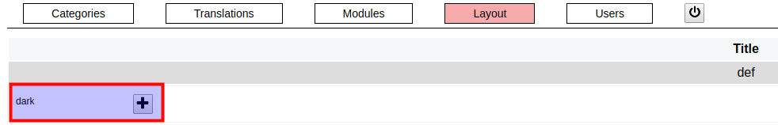
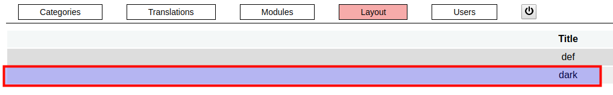
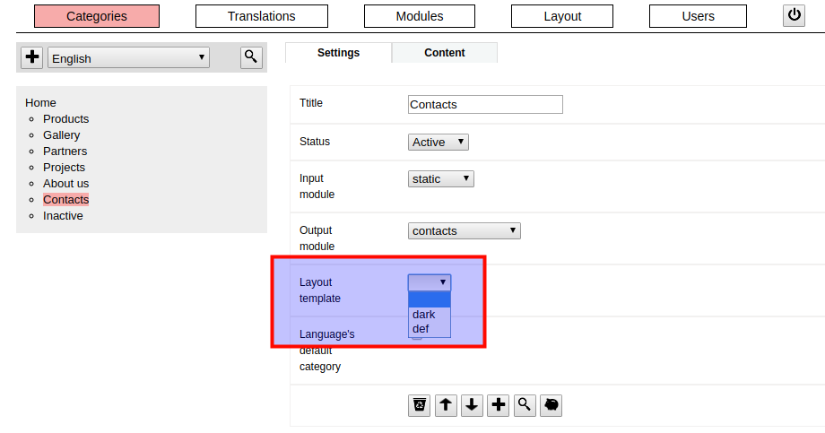

### / [dzhim-cms](./../../../) / [docs](./../../) / [How-to](./../) / [Change page layout](./)

-----------------------------------------------------------------------------------

## Add a new layout

* Copy any existing layout from the [fmw/common/layout/](../../fmw/common/layout/).
* Go to [`Layouts`](http://dzhim-cms.local/admin/layout).
* Under the layout list, there  will be visible the new layout, next to the '+' button.

* Click on the '+' button, to make this layout available.

## Change page layout

