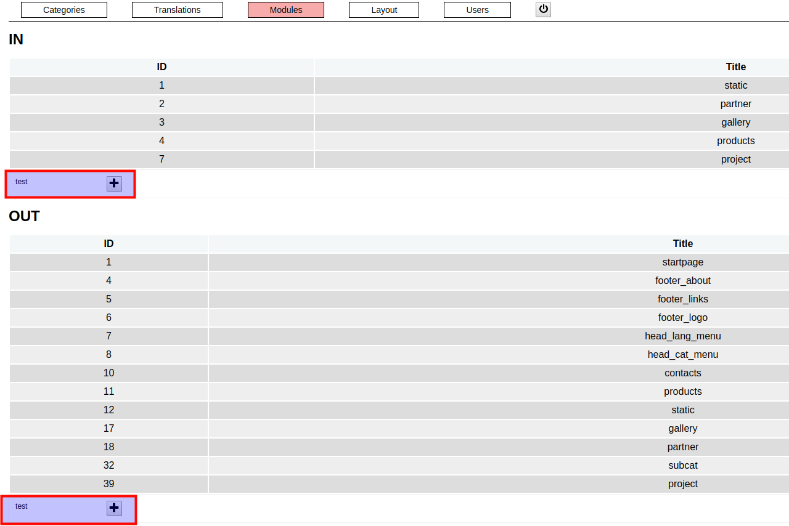
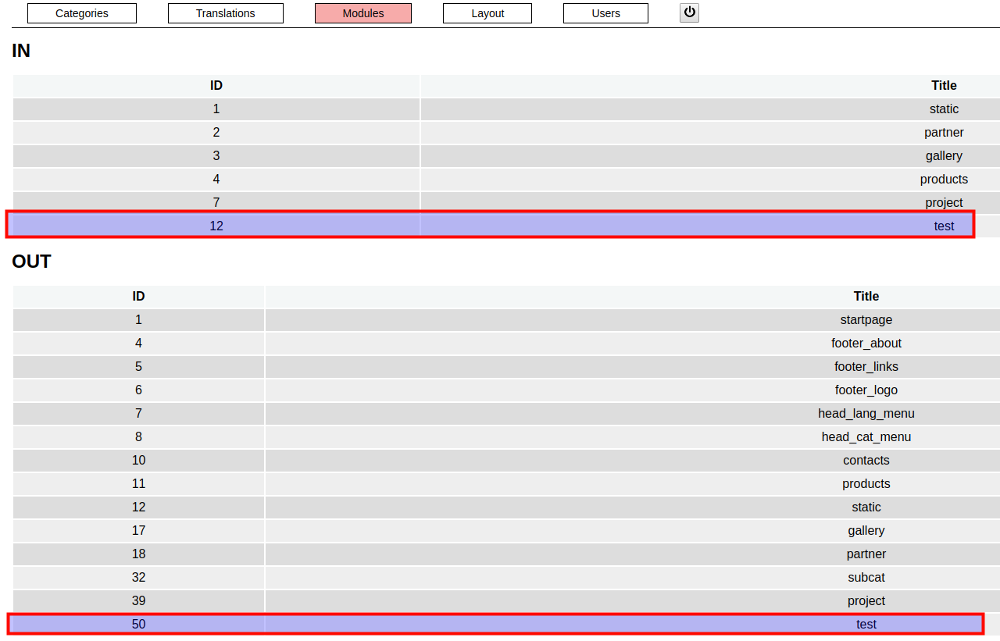
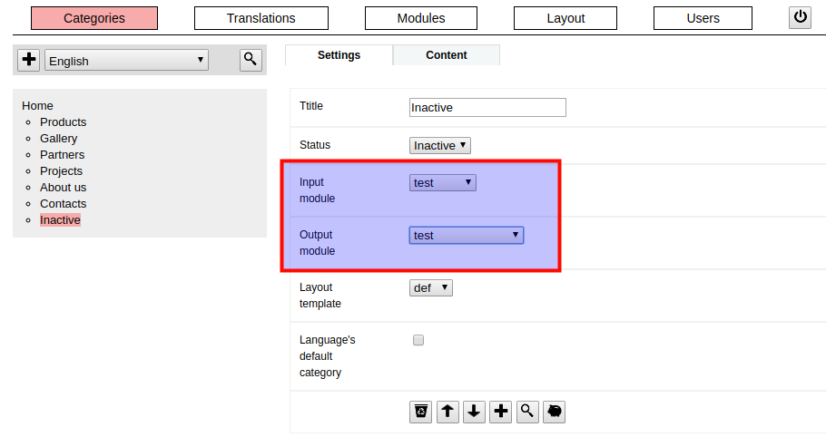

### / [dzhim-cms](./../../../) / [docs](./../../) / [How-to](./../) / [Change page module](./)

-----------------------------------------------------------------------------------

## Add a new module

* Copy any module from the [fmw/mod/](../../fmw/mod/). For example, `clean` is specialy created there for that purpose.
* Go to [Modules](http://dzhim-cms.local/admin/mod).
* Under the module list, there will be visible the new module, next to the '+' button.

* Click on the '+' button, to enable the module.

## Change page's module

