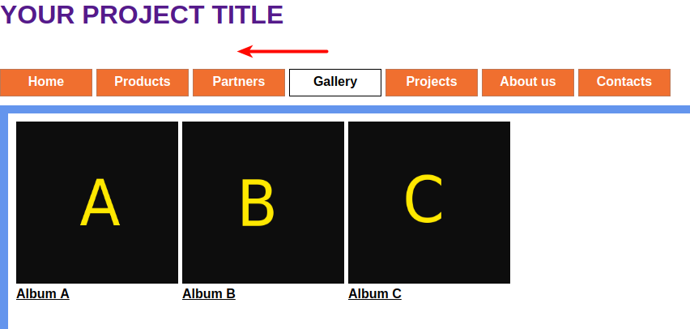
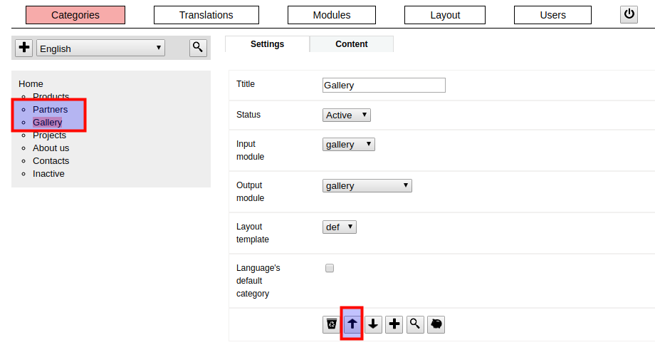
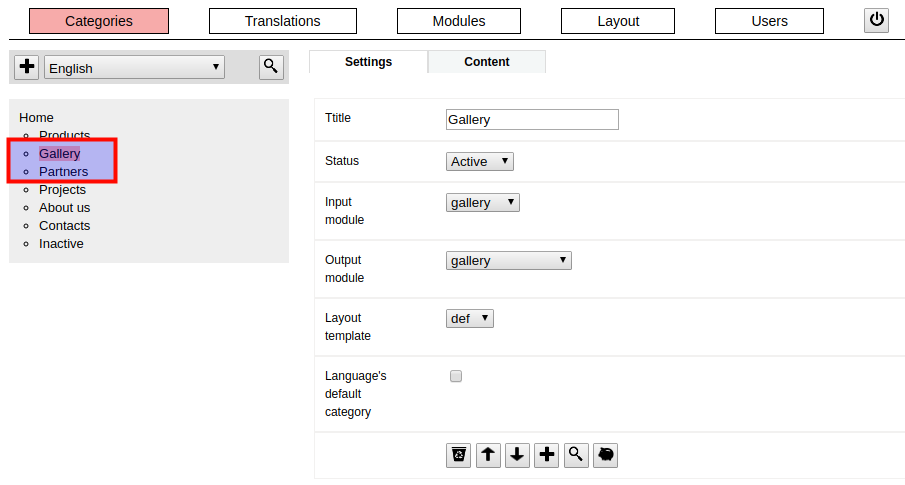
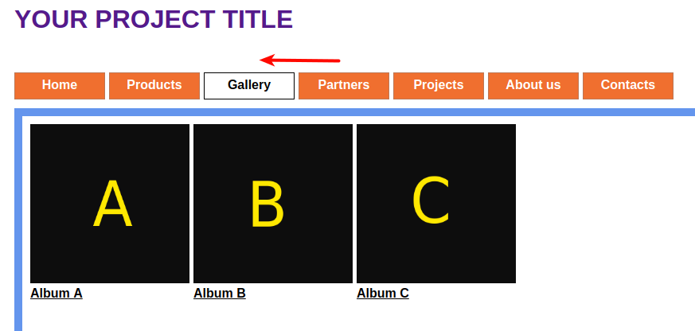

### / [dzhim-cms](./../../../) / [docs](./../../) / [How-to](./../) / [Change page sequence](./)

-----------------------------------------------------------------------------------

# Change page's sequence in a menu

For example, You want to switch places 2 pages - `Gallery` and `Partners`.

* Go to the `Gallery's` settings.
* Click on the `up arrow` at the bottom of the form.

* Now the `Gallery` and `Partners` have switched places.

