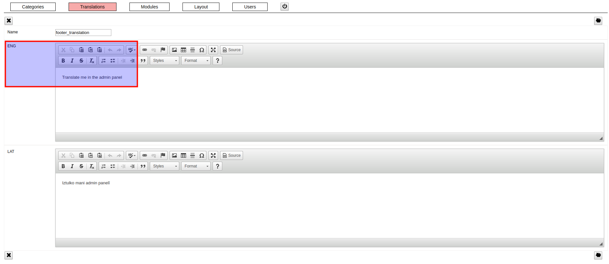

### / [dzhim-cms](./../../../) / [docs](./../../) / [How-to](./../) / [Change translation](./)

-----------------------------------------------------------------------------------

# Change translations

For example, let's change the footers translation in English.

* Go to [Translations](http://dzhim-cms.local/admin/transl/list).

* Open the translation. 

* Change the 'EN' translation and click on the save button (piggy).

* Check that the translation has changed in English.

* Check that the Latvian translation has not changed.

