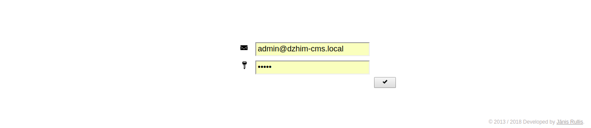
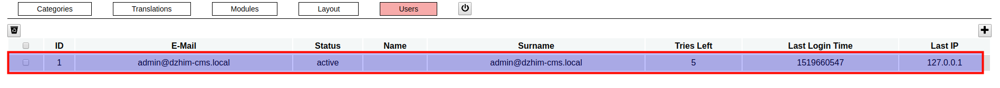
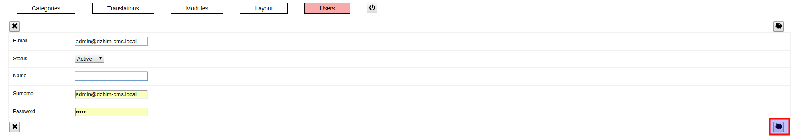
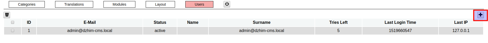
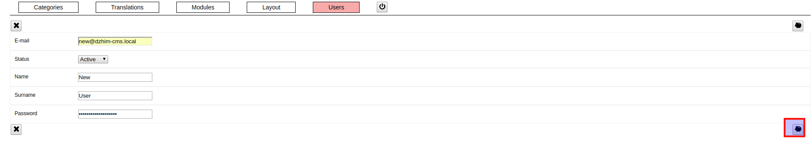
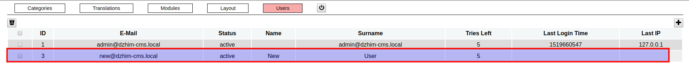
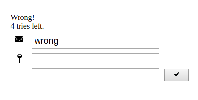
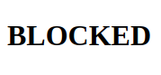
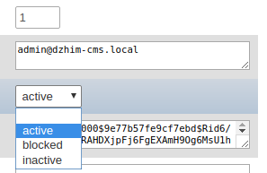
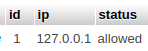

### / [dzhim-cms](./../../../) / [docs](./../../) / [How-to](./../) / [Manage admins users and IP](./)

-----------------------------------------------------------------------------------

# Manage admin users

## How can I access the admin panel for the first time?

* Go to the [Login page](http://dzhim-cms.local/admin/).
* Email: admin@dzhim-cms.local
* Password: admin

## Update an existing user

* Find the user in the list and click on it.

* Change the data and click on the save button (piggy).

## Create a new user

* Click on the '+' button in the user list.

* Fill the required data.

* User will be added to the list after a successful save.

## My user was blocked. What to do?

5 incorrect attempts will block the user

If You can, log-in with another admin account and go to the 'Users', find the blocked account,
change the status, save.
If You don't have another account, log into Your database and go to the `dzhim__usr` table,
find the blocked account, change the status to 'active'.

## How to allow another IP?

I haven't created an admin interface for this yet, so You need to add a record to the `dzhim_ip` table.

