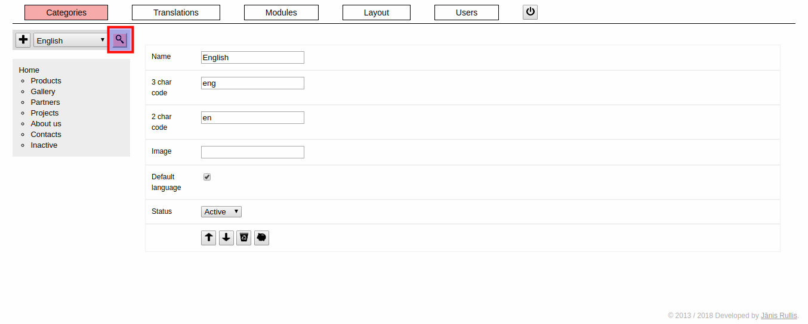
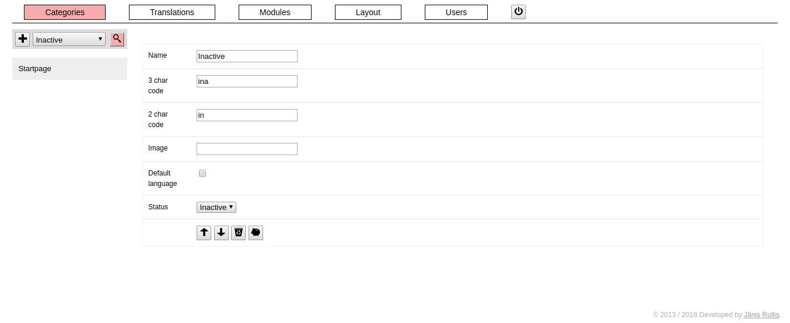

### / [dzhim-cms](./../../../) / [docs](./../../) / [How to](./../) / [Manage languages](./)

-----------------------------------------------------------------------------------

# How to manage languages?

## How to create a new language?

* Click on the '+' (add) button on the left size of the language select.

## How to edit an existing language?

* Click on the magnifying glass button (view) on the right side of the language select.

### Disable a language?

* Change status to 'Inactive'. Change to 'Active' to enable it again.

### Keep enabled, but hide in the menu

* Change status to 'Do not show in the menu'.
