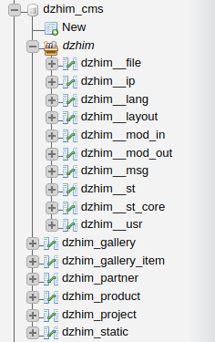

# Setup

## Environment
Last tested on `Ubuntu 16.04` with `NGINX 1.10.3`, `PHP 7.0.22`, `MariaDB 10.2.22`.

## Add dzhim-cms.local to hosts

### Open the hosts file
`sudo nano /etc/hosts`

### Add this record
`127.0.0.1	dzhim-cms.local`

## Enable the NGINX vhost
`sudo ln -s /var/www/dzhim-cms/setup/dzhim-cms.conf /etc/nginx/sites-enabled/dzhim-cms.conf`

### Restart NGINX
`sudo systemctl restart nginx.service`

## Go to the project's directory
`cd /var/www/dzhim-cms`

##  Import DB
* `mysql -uroot -p --default-character-set=utf8 dzhim_cms -f < setup/dzhim-cms.sql `

### The database structure

## Install dependencies
`composer install`

## Edit [fmw/config.php](../fmw/config.php)
* Set `DB_USER`, `DB_PASSWORD`, `DB_NAME`.

## Check the site
[http://dzhim-cms.local](http://dzhim-cms.local)

## Check the admin panel
[http://dzhim-cms.local/admin](http://dzhim-cms.local/admin).

### Admin credentials
* User: admin@dzhim-cms.local
* Password: admin

--------------------------------

 Created in 2013 / Re-animated in Feb 2018.

